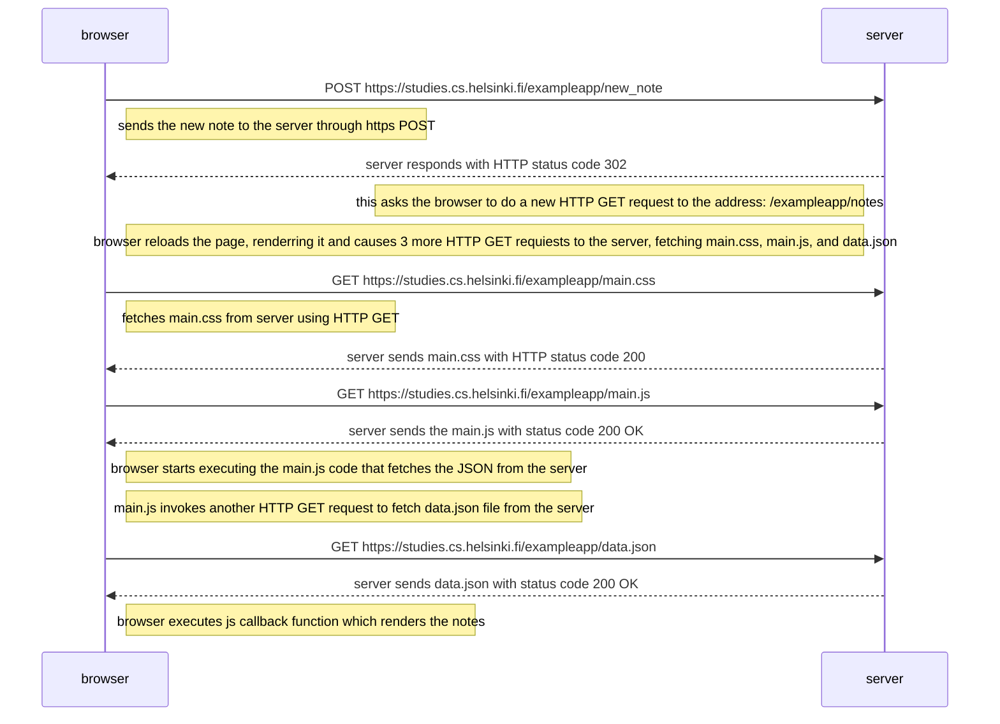

# Exercise 0.4 | New note diagram
## Link: https://fullstackopen.com/en/part0/fundamentals_of_web_apps#exercises-0-1-0-6

```mermaid
sequenceDiagram
    participant browser
    participant server

    browser->>server: POST https://studies.cs.helsinki.fi/exampleapp/new_note
    NOTE right of browser: sends the new note to the server through https POST
    server-->>browser: server responds with HTTP status code 302
    NOTE left of server: this asks the browser to do a new HTTP GET request to the address: /exampleapp/notes

    NOTE right of browser: browser reloads the page, renderring it and causes 3 more HTTP GET requiests to the server, fetching main.css, main.js, and data.json

    browser->>server: GET https://studies.cs.helsinki.fi/exampleapp/main.css
    NOTE right of browser: fetches main.css from server using HTTP GET
    server-->>browser: server sends main.css with HTTP status code 200

    browser->>server: GET https://studies.cs.helsinki.fi/exampleapp/main.js
    server-->>browser: server sends the main.js with status code 200 OK

    NOTE right of browser: browser starts executing the main.js code that fetches the JSON from the server

    NOTE right of browser: main.js invokes another HTTP GET request to fetch data.json file from the server
    browser->>server: GET https://studies.cs.helsinki.fi/exampleapp/data.json
    server-->>browser: server sends data.json with status code 200 OK

    NOTE right of browser: browser executes js callback function which renders the notes
```
