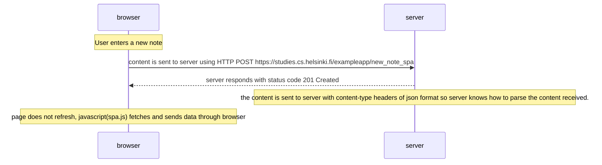

# Exercise 0.6 | New note in single page app diagram

Task: Create a diagram depicting the situation where the user creates a new note using the single-page version of the app.

```mermaid
sequenceDiagram
    participant browser
    participant server

    NOTE over browser: User enters a new note
    browser->>server: content is sent to server using HTTP POST https://studies.cs.helsinki.fi/exampleapp/new_note_spa
    server-->>browser: server responds with status code 201 Created
    NOTE over server: the content is sent to server with content-type headers of json format so server knows how to parse the content received.

    NOTE over browser: page does not refresh, javascript(spa.js) fetches and sends data through browser
```
